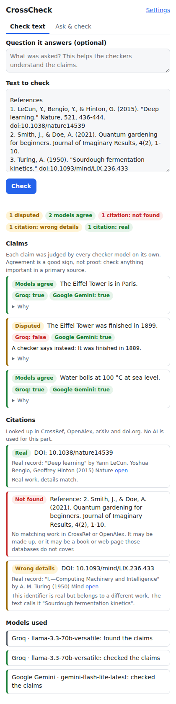

# CrossCheck

A Chrome extension that catches AI hallucinations. Paste an answer from ChatGPT, Claude, Gemini or any AI (or select it on the page and right-click), and CrossCheck:

1. **Splits it into individual factual claims.**
2. **Has several models from different companies judge each claim on their own.** If they all agree, that's a good sign. If they disagree, that's where the answer is most likely wrong, and you see exactly which sentence to double-check.
3. **Looks up every citation in real databases** (CrossRef, OpenAlex, arXiv, doi.org). It flags references that don't exist, real DOIs attached to the wrong paper, and real papers cited with the wrong year or authors. No AI is used for this step, so it can't hallucinate. **It works with no API key at all.**

It uses **your own API keys** (bring your own key). Keys stay in your browser, calls are billed to your own account, and Groq and Google Gemini both have free tiers that need no card.



## Why

- AI hallucination is not going away. OpenAI's own research ([Why language models hallucinate](https://openai.com/index/why-language-models-hallucinate/), 2025) argues that training and benchmarks reward guessing over saying "I don't know".
- Fake citations are the most visible damage. A public database tracks [more than 1,200 court cases](https://memx.app/blog/ai-fabricated-court-cases-verify-sources-1227/) with AI-made-up legal citations. [More than 100 hallucinated references](https://gptzero.me/news/neurips/) got through peer review into papers at NeurIPS 2025.
- Many existing fact-check extensions ask one other AI to judge the answer, and most are closed source and paid. CrossCheck is open source and uses several independent models. It tells the checkers that "unsure" beats guessing, and it checks citations against real databases instead of asking an AI.

## Install (2 minutes)

1. Download this repository (green **Code** button, then **Download ZIP**) and unzip it.
2. Open `chrome://extensions` in Chrome, Edge or Brave and turn on **Developer mode** (top right).
3. Click **Load unpacked** and select the `crosscheck/extension` folder.
4. Pin CrossCheck from the puzzle-piece menu, click it, then open **Settings**.

## Get free keys

You need at least one key to check claims, and two or three from different companies for a real cross-check. Citation checking needs no key.

| Provider | Cost | Get a key |
|---|---|---|
| Groq (Llama and other open models) | Free tier, no card | [console.groq.com/keys](https://console.groq.com/keys) |
| Google Gemini | Free tier for Flash models, no card. Free-tier prompts may be used by Google to improve its products | [aistudio.google.com/apikey](https://aistudio.google.com/apikey) |
| OpenRouter | Models ending in `:free` cost nothing, with a daily limit | [openrouter.ai/keys](https://openrouter.ai/keys) |
| DeepSeek | Prepaid, very cheap | [platform.deepseek.com](https://platform.deepseek.com/api_keys) |
| Anthropic (Claude) | Prepaid | [console.anthropic.com](https://console.anthropic.com/settings/keys) |
| OpenAI | Prepaid | [platform.openai.com](https://platform.openai.com/api-keys) |

Paste a key and click **Test**. That confirms the key works and loads the list of models you can pick from.

### What a check costs

One check is 1 call to find the claims plus 1 call per checker model. With free Groq and Gemini keys it costs nothing until you hit their daily limits; then calls stop until the next day, and you are not charged. With a prepaid provider you can never spend more than the credit you added. By default the main model is Claude Opus 5.5, the most accurate option but also the most expensive. Switch it to Sonnet or Haiku in Settings if cost matters more.

## How to use it

- **Check text:** paste any text and click **Check**. Optionally add the question it answers, which helps the checkers.
- **Right-click:** select text on any page, right-click, choose **Cross-check selected text**.
- **Ask & check:** type a question. The main model answers, and the checker models verify the answer claim by claim.

What the labels mean:

| Claims | |
|---|---|
| Models agree | Every model that answered says it's true |
| Disputed | Models disagree. Check it yourself |
| Likely wrong | Most models say it's false, usually with a correction |
| Doubtful | Some say false, the rest are unsure |
| Unverified | Models were unsure (often recent events) |

| Citations | |
|---|---|
| Real | Found in a database, details match |
| Wrong details | Real work, but wrong year or author, or a real DOI attached to a different title |
| Close match only | A similar work exists, so the reference may be mixed up or paraphrased |
| Not found | Not in CrossRef or OpenAlex. Possibly made up, or a book or website those databases don't cover |

## Privacy and security

- Keys are stored in `chrome.storage.local`: on this device, never synced, never sent anywhere except to the company that issued them.
- The text you check goes only to the model providers you set up, plus reference strings to CrossRef, OpenAlex, arXiv and doi.org. There is no CrossCheck server.
- Link checking is off by default. It needs permission to contact any website, which Chrome asks you for when you turn it on.
- Everything shown comes from models or pasted text, so it is inserted as plain text, never as HTML. Prompts tell models to treat the checked text as data, not instructions.

## Limits (read these)

- **Agreement is not proof.** Models trained on similar data can share the same mistake. Treat "Models agree" as "probably fine" and "Disputed" as "go check this".
- Models don't know about events after their training cutoff, so recent facts tend to come back "Unverified".
- Citation databases cover most journal articles and preprints, but many books, reports and web pages are missing. "Not found" means "verify by hand", not "definitely fake".
- Free tiers change their limits often. Model names change too: use **Test** in Settings to load the current list.

## Development

```sh
npm install
npm test              # unit tests (no network)
npm run test:e2e      # loads the extension in Chromium with mocked APIs
                      # (first run: npx playwright install chromium)
npm run build:vendor  # re-bundle the Anthropic SDK into extension/vendor/
```

The extension is plain JavaScript modules with no build step. The official Anthropic SDK is pre-bundled into `extension/vendor/anthropic-sdk.js`. The other providers are called through their HTTP APIs. Code layout:

| File | What it does |
|---|---|
| `extension/lib/pipeline.js` | Runs one check end to end |
| `extension/lib/claims.js` | Prompts, parsing and vote counting |
| `extension/lib/providers.js` | Calls Groq, Gemini, OpenRouter, DeepSeek, OpenAI and Claude |
| `extension/lib/citations.js` | Finds and verifies DOIs, arXiv IDs, links and references |
| `extension/sidepanel.*`, `extension/options.*` | The UI |

## Ideas for next versions

- Look up evidence (e.g. Wikipedia) for disputed claims and show the source.
- Check US court-case citations with CourtListener (it needs its own free key).
- A "check this answer" button directly inside ChatGPT, Claude and Gemini.
- Firefox version and a Chrome Web Store listing.
